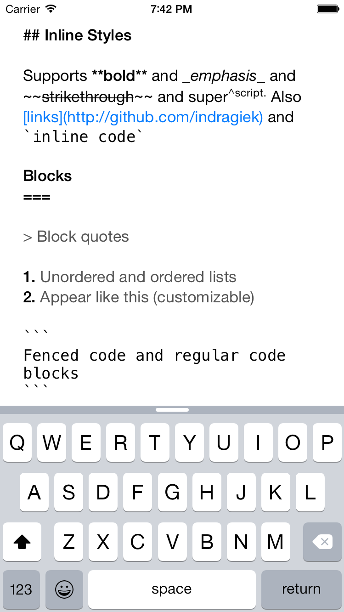

## MarkdownTextView
### Rich Markdown Editing for iOS

**MarkdownTextView** is an iOS framework for adding rich Markdown editing capabilities. Support for Markdown syntax is implemented inside an easily extensible `NSTextStorage` subclass, with a `UITextView` subclass being provided for convenience.

### Screenshot



### Example App

Check out the includeded Example app to try out the text view and to see how **MarkdownTextView** is integrated into the project.

### Installation

###### With [CocoaPods](https://cocoapods.org/):
```ruby
pod "MarkdownTextView"
```

###### With [Carthage](https://github.com/Carthage/Carthage):
```swift
github "indragiek/MarkdownTextView"
```

### Getting Started

The simplest possible usage is as follows:

```swift
let textView = MarkdownTextView(frame: CGRectZero)
view.addSubview(textView)
```

This gives you a text view with support for most of the features defined in the original Markdown implementation (strong, emphasis, inline code, code blocks, block quotes, headers) with the default styling provided by the framework.


### Customizing Appearance

All of the styling can be customized using standard `NSAttributedString` attributes. For example, if you wanted to customize bold text such that it appeared red, you would do this:

```swift
var attributes = MarkdownTextAttributes()
attributes.strongAttributes = [
	NSForegroundColorAttributeName: UIColor.redColor()
]
let textStorage = MarkdownTextStorage(attributes: attributes)
let textView = MarkdownTextView(frame: CGRectZero, textStorage: textStorage)
view.addSubview(textView)
```

### Extensions Support

Extension classes conforming to the `HighlighterType` protocol can be used to add support for unofficial Markdown extensions. The framework comes with the following extensions already implemented:

From [Github Flavored Markdown](https://help.github.com/articles/github-flavored-markdown/):

* `MarkdownStrikethroughHighlighter` - Support for `~~strikethrough~~`
* `MarkdownFencedCodeHighlighter` - Support for fenced code blocks
* `LinkHighlighter` - Support for auto-linking

Other:

* `MarkdownSuperscriptHighlighter` - Support for `super^scripted^text`

These extensions do not come activated by default. They must manually be added to an instance of `MarkdownTextStorage` as follows:

```swift
let textStorage = MarkdownTextStorage()
var error: NSError?
if let linkHighlighter = LinkHighlighter(errorPtr: &error) {
    textStorage.addHighlighter(linkHighlighter)
} else {
    assertionFailure("Error initializing LinkHighlighter: \(error)")
}
textStorage.addHighlighter(MarkdownStrikethroughHighlighter())
textStorage.addHighlighter(MarkdownSuperscriptHighlighter())
if let codeBlockAttributes = attributes.codeBlockAttributes {
    textStorage.addHighlighter(MarkdownFencedCodeHighlighter(attributes: codeBlockAttributes))
}

let textView = MarkdownTextView(frame: CGRectZero, textStorage: textStorage)
view.addSubview(textView)
```

### Credits

* John Gruber's [original Markdown implementation](http://daringfireball.net/projects/markdown/) for most of the regular expressions used in this project.
* [RFMarkdownTextView](https://github.com/ruddfawcett/RFMarkdownTextView) for the idea to implement this as an `NSTextStorage` subclass

### Contact

* Indragie Karunaratne
* [@indragie](http://twitter.com/indragie)
* [http://indragie.com](http://indragie.com)

### License

MarkdownTextView is licensed under the MIT License. See `LICENSE` for more information.
